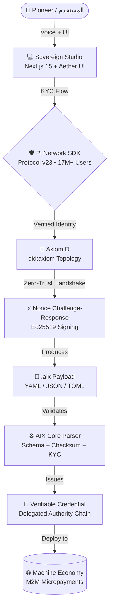

<div align="center">

<a href="https://github.com/Moeabdelaziz007/aix-format">
  
</a>


<br/><br/>

<a href="https://github.com/Moeabdelaziz007/aix-format/actions"></a>
<a href="https://github.com/Moeabdelaziz007/aix-format/blob/main/LICENSE"></a>


<br/><br/>

> **[EN]** *The only open standard that bundles a complete agent definition + KYC-signed identity + economics in a single portable file.*
>
> **[AR]** *المعيار المفتوح الوحيد الذي يجمع تعريف الوكيل الكامل + هوية موقّعة بـ KYC + اقتصاديات في ملف واحد قابل للنقل.*

</div>

---

<details>
<summary><b>📑 Table of Contents | فهرس المحتويات</b></summary>
<br/>

| # | Section (EN) | القسم (AR) |
|:-:|:--|:--|
| 1 | [🎯 The Problem We Solve](#-the-problem-we-solve--المشكلة-التي-نحلها) | المشكلة التي نحلها |
| 2 | [⚡ AIX vs The Ecosystem](#-aix-vs-the-ecosystem--المقارنة-مع-البدائل) | المقارنة مع البدائل |
| 3 | [🧬 Core Architecture](#-core-architecture--الهندسة-الجوهرية) | الهندسة الجوهرية |
| 4 | [✨ Sovereign Features](#-sovereign-features--المميزات-السيادية) | المميزات السيادية |
| 5 | [🔐 Security Model](#-security-model--النموذج-الأمني) | النموذج الأمني |
| 6 | [🛠️ Quick Start](#-quick-start--البدء-السريع) | البدء السريع |
| 7 | [🗺️ Roadmap](#-roadmap--خارطة-الطريق) | خارطة الطريق |
| 8 | [🤝 The Sovereign Hive](#-the-sovereign-hive--الخلية-السيادية) | الخلية السيادية |

</details>

---

## 🎯 The Problem We Solve | المشكلة التي نحلها

<table width="100%">
<tr>
<td width="50%" valign="top">

**[EN]** In February 2026, the **ClawHavoc** campaign compromised **1,184+ agent skills** in a major marketplace — including credential stealers that bypassed VirusTotal. 492 MCP servers were found exposed with **zero authentication**.

The root cause: there is no open standard requiring human-verified identity for AI agents. Any anonymous actor can publish a malicious agent.

**AIX is the fix.** Every `.aix` payload is cryptographically signed and bound to a real, KYC-verified Pi Network identity. Anonymous agent attacks become structurally impossible.

</td>
<td width="50%" valign="top" dir="rtl">

**[AR]** في فبراير 2026، اخترقت حملة **ClawHavoc** أكثر من **1,184 مهارة** في أحد أكبر أسواق الوكلاء — بما فيها سارقو بيانات اعتماد تجاوزوا VirusTotal. تم الكشف عن 492 خادم MCP مُكشوف بلا أي مصادقة.

السبب الجذري: لا يوجد معيار مفتوح يشترط هوية مُحققة للوكلاء. أي جهة مجهولة تستطيع نشر وكيل خبيث.

**AIX هو الحل.** كل ملف `.aix` موقّع تشفيرياً ومرتبط بهوية Pi Network حقيقية ومُحققة بـ KYC. الهجمات المجهولة تصبح مستحيلة هيكلياً.

</td>
</tr>
</table>

---

## ⚡ AIX vs The Ecosystem | المقارنة مع البدائل

> **[EN]** AIX occupies a unique white space — the **Identity + Distribution layer** that all other standards lack.
>
> **[AR]** يحتل AIX موقعاً فريداً في **طبقة الهوية والتوزيع** الغائبة عن جميع المعايير الأخرى.

| Feature | **AIX Format** | A2A AgentCard | OSSA v0.5 | AgentFacts/KYA |
|:--------|:-:|:-:|:-:|:-:|
| **Agent Identity (DID)** | ✅ `did:axiom` | ❌ | ❌ | ⚠️ partial |
| **KYC / Proof of Personhood** | ✅ Pi Network (17M+) | ❌ | ❌ | ⚠️ concept only |
| **Economics / Pricing Layer** | ✅ built-in | ❌ | ❌ | ❌ |
| **Checksum / Supply Chain** | ✅ SHA-256 + Ed25519 | ❌ | ❌ | ⚠️ planned |
| **VLA / Robotics Support** | ✅ openpi, π0.7 | ❌ | ❌ | ❌ |
| **MCP Server Embedding** | ✅ | ❌ | ✅ | ❌ |
| **Multi-Format** | ✅ YAML/JSON/TOML | ❌ JSON only | ✅ | ❌ |
| **A2A Compatible** | ⚠️ converter exists | ✅ native | ⚠️ | ❌ |
| **Focus Layer** | Identity + Distribution | Runtime Comm. | Contract | Enterprise Meta |

> 💡 **[EN]** A2A is not a competitor — it handles *runtime agent communication*. AIX handles *agent definition and distribution*. They are complementary.
>
> 💡 **[AR]** A2A ليس منافساً — بل يتعامل مع *التواصل وقت التشغيل*، بينما AIX يتعامل مع *تعريف الوكيل وتوزيعه*. هما متكاملان.

---

## 🧬 Core Architecture | الهندسة الجوهرية

<table width="100%">
<tr>
<td width="50%" valign="top">

**[EN]** A high-performance Monorepo integrating the **AIX validation engine** with a **Next.js 15** sovereign studio. The trust chain flows from human KYC identity down to every machine action — from agent publishing to M2M micropayments.

</td>
<td width="50%" valign="top" dir="rtl">

**[AR]** مستودع Monorepo متكامل يجمع بين **محرك التحقق AIX** و**استوديو Next.js 15** السيادي. تنساب سلسلة الثقة من هوية KYC البشرية وصولاً إلى كل إجراء آلي — من نشر الوكلاء إلى المدفوعات الدقيقة بين الآلات.

</td>
</tr>
</table>



**[EN] Monorepo Structure | [AR] هيكل المستودع:**

```
aix-format/
├── core/                    # AIX Parser Engine | محرك المحلل
│   ├── src/parser.js        # Schema validation + checksum verification
│   ├── src/axiomid.js       # Ed25519 identity layer
│   └── src/converters/      # A2A AgentCard ↔ AIX converters
├── apps/studio/             # Sovereign Studio UI | واجهة الاستوديو
│   └── src/app/             # Next.js 15 App Router
├── bin/
│   └── aix-validate.js      # CLI Validator | مدقق سطر الأوامر
└── .github/workflows/
    └── aix-validation.yml   # Automated security CI | الأمن الآلي
```

---

## ✨ Sovereign Features | المميزات السيادية

<table width="100%">
<tr>
<td width="50%">

### 🛡️ Agentic KYC & AxiomID
Every `.aix` payload is signed with **Ed25519** and anchored to a Pi KYC-verified identity via the `did:axiom` topology. A **Zero-Trust Handshake** with nonce-based challenge-response prevents Sybil and replay attacks.

</td>
<td width="50%" dir="rtl">

### 🛡️ التوثيق السيادي وAxiomID
كل ملف `.aix` موقّع بـ **Ed25519** ومُرتبط بهوية Pi مُحققة بـ KYC عبر بنية `did:axiom`. **مصافحة انعدام الثقة** بآلية Nonce تمنع هجمات التزييف وإعادة الإرسال.

</td>
</tr>
<tr>
<td width="50%">

### 💰 Native Economics Layer
Built-in support for Pi Network **Protocol v23 smart contracts** — enabling pay-per-call, subscriptions, and M2M micropayments without third-party payment rails.

</td>
<td width="50%" dir="rtl">

### 💰 طبقة الاقتصاد الأصيلة
دعم مدمج للعقود الذكية على **بروتوكول Pi v23** — تُتيح المدفوعات لكل طلب، الاشتراكات، والمدفوعات الدقيقة بين الآلات دون وسطاء.

</td>
</tr>
<tr>
<td width="50%">

### 🤖 VLA / Robotics Support
The **only** agent standard with first-class support for Vision-Language-Action models (`openpi`, `π0.7`). Describe a robot arm controller the same way you describe a chat agent.

</td>
<td width="50%" dir="rtl">

### 🤖 دعم الروبوتات وVLA
**المعيار الوحيد** بدعم أصيل لنماذج الرؤية-اللغة-الفعل (`openpi`، `π0.7`). صِف مُتحكم ذراع روبوتية بنفس الطريقة التي تصف بها وكيل محادثة.

</td>
</tr>
<tr>
<td width="50%">

### 📦 Agent Bill of Materials (ABOM)
Like SBOM for software, AIX captures the full provenance of every agent: training data, base models, APIs, MCP servers — with SHA-256 checksums for supply chain security.

</td>
<td width="50%" dir="rtl">

### 📦 فاتورة مواد الوكيل (ABOM)
كـ SBOM للبرمجيات، يلتقط AIX كامل نسب أي وكيل: بيانات التدريب، النماذج الأساسية، الـ APIs، خوادم MCP — مع فحوصات SHA-256 لأمان سلسلة التوريد.

</td>
</tr>
<tr>
<td width="50%">

### 🎙️ Voice-First Studio
Our **Interactive Voice Orb** leverages high-fidelity TTS/STT for a conversational configuration experience. Chatboxes are a legacy constraint. Speak your agent into existence.

</td>
<td width="50%" dir="rtl">

### 🎙️ الاستوديو الصوتي أولاً
**الكرة الصوتية التفاعلية** تعتمد على تقنيات TTS/STT عالية الجودة لتجربة تهيئة حوارية طبيعية. صناديق الدردشة قيد من الماضي. تحدث فقط لإنشاء وكيلك.

</td>
</tr>
</table>

---

## 🔐 Security Model | النموذج الأمني

<table width="100%">
<tr>
<td width="50%" valign="top">

**[EN]** Three cryptographic pillars — no security theater, no placeholders:

| Pillar | Technology | Guarantees |
|:------:|:-----------|:-----------|
| 🔵 **Identity** | Pi Network KYC | *Who published this agent?* |
| 🟣 **Integrity** | Ed25519 signatures | *Has this file been tampered with?* |
| 🟢 **Authorization** | Verifiable Credentials | *What is this agent allowed to do?* |

```yaml
security:
  checksum:
    algorithm: "sha256"
    value: "a3f8c2..."
  signature:
    algorithm: "Ed25519"
    signer: "did:axiom:axiomid.app:verified_user"
  mcp:
    servers:
      - checksum: "sha256:abc123..."
        allowed_tools: ["read_file"]
        max_permissions: "read-only"
```

</td>
<td width="50%" valign="top" dir="rtl">

**[AR]** ثلاثة أعمدة تشفيرية — لا مسرحية أمنية، لا عناصر وهمية:

| العمود | التقنية | الضمان |
|:------:|:--------|:-------|
| 🔵 **الهوية** | Pi Network KYC | *من نشر هذا الوكيل؟* |
| 🟣 **السلامة** | توقيعات Ed25519 | *هل تم التلاعب بالملف؟* |
| 🟢 **التفويض** | شهادات قابلة للتحقق | *ما المسموح له بفعله؟* |

**لماذا يهم هذا؟** في فبراير 2026، اخترقت حملة ClawHavoc أكثر من 1,184 مهارة في سوق وكلاء بارز. بنية AIX تجعل هذا النوع من الهجمات مستحيلاً هيكلياً — لأن كل وكيل مُرتبط بإنسان حقيقي مُحقق.

</td>
</tr>
</table>

---

## 🛠️ Quick Start | البدء السريع

**Prerequisites | المتطلبات:** Node.js `v18+` · Git · Pi Browser *(for production KYC)*

```bash
# Clone & bootstrap | الاستنساخ والتثبيت
git clone https://github.com/Moeabdelaziz007/aix-format.git
cd aix-format && npm install

# Launch Sovereign Studio | تشغيل الاستوديو
npm run dev --prefix apps/studio

# Validate an agent file | التحقق من ملف وكيل
node bin/aix-validate.js my-agent.aix

# Strict KYC + security validation | التحقق الصارم
node bin/aix-validate.js my-agent.aix --strict-kyc --security

# Run full test suite | تشغيل كل الاختبارات
npm test
```

**Anatomy of a `.aix` file | تشريح ملف `.aix`:**

```yaml
# my-agent.aix
meta:
  name: "research-assistant"
  version: "1.0.0"
  aix_version: "0.3"

identity_layer:
  id: "did:axiom:axiomid.app:agent_uuid"
  kyc_provider: "pi_network"
  kyc_proof: "verified_pi_token"

economics:
  token: "PI"
  cost_per_task: 0.5
  pi_contract:
    type: "pay_per_call"

security:
  checksum:
    algorithm: "sha256"
    value: "sha256_of_all_fields"
  signature:
    algorithm: "Ed25519"
    signer: "did:axiom:axiomid.app:publisher"

capabilities:
  - "research"
  - "summarization"

mcp:
  servers:
    - name: "brave-search"
      command: "npx @modelcontextprotocol/brave-search"
```

---

## 🗺️ Roadmap | خارطة الطريق

<table width="100%">
<tr>
<td width="33%" valign="top">

**🔴 Phase 1 — Foundation**
*Days 1–30*

- [ ] A2A AgentCard bidirectional converter
- [ ] `did:web` / `did:key` W3C DID support
- [ ] MCP server checksum validation
- [ ] OSSA v0.5 compatibility layer

</td>
<td width="33%" valign="top">

**🟡 Phase 2 — Ecosystem**
*Days 31–60*

- [ ] Pi Network Protocol v23 smart contracts
- [ ] W3C Verifiable Credentials (VC)
- [ ] IPFS / Arweave content-addressable distribution
- [ ] `aix-publish` CLI + `registry.aix-format.org`

</td>
<td width="33%" valign="top">

**🟢 Phase 3 — Launch v1.0**
*Days 61–90*

- [ ] Full security audit + threat model
- [ ] W3C AI Agent Protocol CG submission
- [ ] `@aix/core` npm package
- [ ] Product Hunt + Show HN launch

</td>
</tr>
</table>

---

## 🤝 The Sovereign Hive | الخلية السيادية

> *A sovereign system is built by a sovereign team. | النظام السيادي يُبنى بفريق سيادي.*

<div align="center">

<table>
<tr>

<td align="center" width="220">
  <a href="https://github.com/Moeabdelaziz007">
    
  </a>
  <br/><br/>
  <b>Mohamed Abdelaziz</b>
  <br/>
  <sub>🏛️ Visionary Architect · المهندس المعماري</sub>
  <br/><br/>
  <a href="https://github.com/Moeabdelaziz007">
    
  </a>
</td>

<td align="center" width="220">
  
  <br/><br/>
  <b>Jules</b>
  <br/>
  <sub>🎨 UI/UX Agent · مهندس التنفيذ والواجهة</sub>
  <br/><br/>
  
</td>

<td align="center" width="220">
  
  <br/><br/>
  <b>Antigravity</b>
  <br/>
  <sub>⚙️ Systems Architect & Security AI · مهندس الأنظمة والأمن</sub>
  <br/><br/>
  
</td>

</tr>
</table>

</div>

---

<div align="center">


*"We are not building tools; we are architecting the trust layer for the future of intelligence."*
<br/>
*"نحن لا نبني أدوات؛ نحن نصمم طبقة الثقة لمستقبل الذكاء."*

<br/>


&nbsp;


</div>
