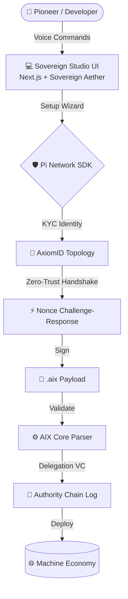

# 🌐 Sovereign Pi Agents Studio & AIX Format

<div align="center">
  
  <h1>The Sovereign Machine Economy</h1>
  <h2>اقتصاد الآلات السيادي</h2>

  <p>
    <a href="https://github.com/Moeabdelaziz007/aix-format/actions"></a>
    <a href="https://github.com/Moeabdelaziz007/aix-format/blob/main/LICENSE"></a>
    
    
    
    
  </p>

  <p><i>The Global Marketplace for Autonomous AI Agents — Powered by Pi Network KYC & Ed25519 Cryptography</i></p>
  <p><i>السوق العالمي لوكلاء الذكاء الاصطناعي المستقلين — مدعوم بـ Pi Network KYC وتشفير Ed25519</i></p>
</div>

---

## 📋 Table of Contents | فهرس المحتويات

| # | Section / القسم |
|---|---|
| 1 | [🧬 The Vision / الرؤية](#-the-vision--الرؤية) |
| 2 | [✨ Sovereign Features / المميزات](#-sovereign-features--المميزات-السيادية) |
| 3 | [🏗️ Architecture / الهندسة](#%EF%B8%8F-technical-architecture--الهندسة-المعمارية) |
| 4 | [🛠️ Engineering Operations / التشغيل](#%EF%B8%8F-engineering-operations--العمليات-الهندسية) |
| 5 | [📈 Recent Evolution / التطورات](#-recent-evolution--التطورات-الأخيرة) |
| 6 | [🔐 Security Model / نموذج الأمن](#-security-model--نموذج-الأمن) |
| 7 | [🤝 The Collaborative Hive / الخلية التعاونية](#-the-collaborative-hive--الخلية-التعاونية) |

---

## 🧬 The Vision | الرؤية

<table width="100%">
<tr>
<td width="50%" valign="top">

**[EN]** Autonomous Agents today face two existential crises: **Distribution** and **Trust**. By bridging the **AIX format** with the decentralized infrastructure of the **Pi Network**, we are architecting a trustless micro-transaction economy. The **Sovereign Pi Agents Studio** provides a high-fidelity, voice-first gateway for Pioneers to manifest, verify, and deploy agents into a global machine-to-machine (M2M) network.

</td>
<td width="50%" valign="top" dir="rtl">

**[AR]** التحدي الأكبر للوكلاء المستقلين اليوم ليس الذكاء، بل **التوزيع** و**الثقة**. من خلال ربط صيغة **AIX** مع البنية التحتية اللامركزية لشبكة **Pi**، نحن نبني اقتصاداً حقيقياً للمعاملات الدقيقة بين الآلات. يوفر **استوديو الوكلاء السياديين** بوابة صوتية متطورة تتيح للمستخدمين إعداد الوكلاء وتوقيعهم بهوية Pi KYC ونشرهم في الشبكة العالمية.

</td>
</tr>
</table>

---

## ✨ Sovereign Features | المميزات السيادية

### 🎙️ Voice-First Orchestration | التوجيه الصوتي أولاً
<table width="100%"><tr>
<td width="50%" valign="top">

**[EN]** Chatboxes are a legacy constraint. Our **Interactive Voice Orb** leverages high-fidelity TTS and STT for a natural, conversational configuration experience. Speak your agent into existence.

</td>
<td width="50%" valign="top" dir="rtl">

**[AR]** صناديق الدردشة قيد من الماضي. تعتمد **الكرة الصوتية التفاعلية** على تقنيات تحويل النص إلى صوت والكلام إلى نص لتوفير تجربة محادثة طبيعية. تحدث فقط لإنشاء وكيلك.

</td>
</tr></table>

### 🛡️ Agentic KYC & AxiomID | التوثيق السيادي
<table width="100%"><tr>
<td width="50%" valign="top">

**[EN]** Security is non-negotiable. Every `.aix` payload is signed using **Ed25519** and bound to a verified **Pi KYC** identity via the **AxiomID** topology. A **Zero-Trust Handshake** with nonce-based challenge-response prevents Sybil attacks and replay attacks.

</td>
<td width="50%" valign="top" dir="rtl">

**[AR]** الأمن غير قابل للتفاوض. يتم توقيع كل ملف `.aix` باستخدام **Ed25519** وربطه بهوية **Pi KYC** عبر بنية **AxiomID**. تمنع **مصافحة انعدام الثقة** مع آلية Nonce هجمات التزييف وإعادة الإرسال.

</td>
</tr></table>

### 💠 Sovereign Aether UI | واجهة الأثير السيادي
<table width="100%"><tr>
<td width="50%" valign="top">

**[EN]** Experience a design system that feels alive. Our **Glassmorphism** interface uses deep indigos, translucent layers, and dynamic micro-animations to create a premium, futuristic atmosphere.

</td>
<td width="50%" valign="top" dir="rtl">

**[AR]** اختبر نظام تصميم يشع بالحياة. تعتمد واجهة **Glassmorphism** على الألوان العميقة والطبقات الشفافة والرسوم المتحركة الدقيقة لخلق بيئة مستقبلية راقية.

</td>
</tr></table>

### 📜 Delegated Authority Chains | سلاسل التفويض السيادي
<table width="100%"><tr>
<td width="50%" valign="top">

**[EN]** Agents can delegate authority to sub-agents using **Verifiable Credentials (VCs)**. Every delegation is cryptographically chained, creating a tamper-evident audit log of all agentic actions — the foundation of sovereign trust.

</td>
<td width="50%" valign="top" dir="rtl">

**[AR]** يمكن للوكلاء تفويض صلاحياتهم للوكلاء الفرعيين باستخدام **الشهادات القابلة للتحقق (VCs)**. كل تفويض مرتبط تشفيرياً، مما يخلق سجل تدقيق محمياً لجميع إجراءات الوكلاء.

</td>
</tr></table>

---

## 🏗️ Technical Architecture | الهندسة المعمارية

<table width="100%">
<tr>
<td width="50%" valign="top">

**[EN]** The ecosystem is a high-performance Monorepo integrating the core AIX validation engine with a state-of-the-art Next.js 15 frontend. The trust chain flows from human identity down to every machine action.

</td>
<td width="50%" valign="top" dir="rtl">

**[AR]** تم بناء المشروع على هيكل Monorepo حديث، يربط بين محلل AIX الأساسي وواجهة أمامية متطورة بـ Next.js 15. تنساب سلسلة الثقة من هوية الإنسان وصولاً إلى كل إجراء آلي.

</td>
</tr>
</table>



---

## 🛠️ Engineering Operations | العمليات الهندسية

<table width="100%">
<tr>
<td width="50%" valign="top">

**[EN] Prerequisites**
- **Node.js**: v18.0.0+
- **Pi Browser**: Required for production KYC authentication
- **Git**: For version control and deployment
- **tweetnacl**: Cryptographic core (isomorphic Ed25519)

</td>
<td width="50%" valign="top" dir="rtl">

**[AR] المتطلبات الأساسية**
- **Node.js**: الإصدار 18.0.0 وما فوق
- **متصفح Pi**: مطلوب للمصادقة عبر KYC في بيئة الإنتاج
- **Git**: لإدارة الإصدارات والنشر
- **tweetnacl**: النواة التشفيرية (Ed25519 متعدد البيئات)

</td>
</tr>
</table>

### Local Development | التطوير المحلي
```bash
# Initialize the ecosystem | تثبيت الاعتمادات
npm install

# Launch the Sovereign Studio | تشغيل الاستوديو
npm run dev --prefix apps/studio

# Run the security validation suite | تشغيل حزمة التحقق الأمني
npm test
```

---

## 📈 Recent Evolution | التطورات الأخيرة (v0.3.0 Stable)

<table width="100%">
<tr>
<td width="50%" valign="top">

**[EN]**
- ✅ **Zero-Trust Handshake**: Nonce-based Ed25519 challenge-response implemented.
- ✅ **AxiomID Cryptography**: Finalized Ed25519 signature validation via `tweetnacl`.
- ✅ **Delegated Authority VCs**: Schema updated with `delegation_credential_vc` fields.
- ✅ **Next.js 15 App Router**: 100% migration for SSR performance.
- ✅ **Automated Validation**: Git hooks enforce strict schema compliance.
- ✅ **Replay Attack Prevention**: Nonce expiry at 60-second TTL.

</td>
<td width="50%" valign="top" dir="rtl">

**[AR]**
- ✅ **مصافحة انعدام الثقة**: تم تطبيق آلية Nonce مع Ed25519.
- ✅ **تشفير AxiomID**: الانتهاء من التحقق من توقيع Ed25519 عبر `tweetnacl`.
- ✅ **شهادات التفويض السيادي**: تحديث المخطط بحقول `delegation_credential_vc`.
- ✅ **Next.js 15 App Router**: هجرة كاملة لتحسين عرض الصفحات.
- ✅ **التحقق الآلي**: خطافات Git تفرض الامتثال الصارم للمخطط.
- ✅ **منع هجمات إعادة الإرسال**: انتهاء صلاحية الـ Nonce بعد 60 ثانية.

</td>
</tr>
</table>

---

## 🔐 Security Model | نموذج الأمن

<table width="100%">
<tr>
<td width="50%" valign="top">

**[EN]** Our security architecture is built on three pillars:
1. **Identity (Who are you?)** — Pi Network KYC verification
2. **Integrity (Did you send this?)** — Ed25519 message signatures
3. **Authorization (Can you do this?)** — Verifiable Credential delegation chains

</td>
<td width="50%" valign="top" dir="rtl">

**[AR]** تقوم معماريتنا الأمنية على ثلاثة أعمدة:
1. **الهوية (من أنت؟)** — التحقق من Pi Network KYC
2. **السلامة (هل أرسلت هذا؟)** — توقيعات الرسائل بـ Ed25519
3. **التفويض (هل يحق لك ذلك؟)** — سلاسل تفويض الشهادات القابلة للتحقق

</td>
</tr>
</table>

---

## 🤝 The Collaborative Hive | الخلية التعاونية

> *A sovereign system is built by a sovereign team. / النظام السيادي يُبنى بفريق سيادي.*

<div align="center">

<table>
<tr>

<td align="center" width="220">
  <a href="https://github.com/Moeabdelaziz007">
    
  </a>
  <br/><br/>
  <b>Mohamed Abdelaziz</b>
  <br/>
  <sub>🏛️ Visionary Architect</sub>
  <br/>
  <sub>المهندس المعماري والرؤيوي</sub>
  <br/>
  <a href="https://github.com/Moeabdelaziz007">
    
  </a>
</td>

<td align="center" width="220">
  
  <br/><br/>
  <b>Jules</b>
  <br/>
  <sub>🎨 UI/UX Agent & Execution Engineer</sub>
  <br/>
  <sub>مهندس التنفيذ وواجهة المستخدم</sub>
  <br/>
  
</td>

<td align="center" width="220">
  
  <br/><br/>
  <b>Antigravity</b>
  <br/>
  <sub>⚙️ Systems Architect & Security AI</sub>
  <br/>
  <sub>مهندس الأنظمة والأمن السيادي</sub>
  <br/>
  
</td>

</tr>
</table>

</div>

---

<div align="center">
  <p><i>"We are not building tools; we are architecting the trust layer for the future of intelligence."</i></p>
  <p><i>"نحن لا نبني أدوات؛ نحن نصمم طبقة الثقة لمستقبل الذكاء."</i></p>
  <br/>
  
</div>
