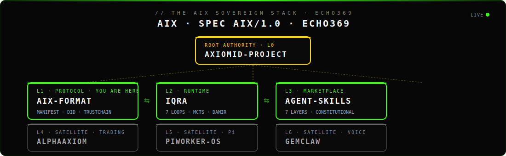

<!-- ════════════════ AIX SOVEREIGN STACK · UNIFIED BRANDING ════════════════ -->

<div align="center">
  
</div>

<div align="center">

[](./AXIOM.md)
[](./AXIOM.md)
[](https://github.com/Moeabdelaziz007/aix-format)
[](./CHANGELOG.md)
[](./LICENSE)

</div>

<div align="center">

[](#-built-by-1-human--9-ai-agents)

</div>

<div align="center">

**Sovereign Stack** &nbsp;·&nbsp; **🟢 L1 · PROTOCOL · `aix-format` · YOU ARE HERE** &nbsp;·&nbsp; [**L2 · RUNTIME · `iqra` →**](https://github.com/Moeabdelaziz007/iqra) &nbsp;·&nbsp; [**L3 · MARKETPLACE · `aix-agent-skills` →**](https://github.com/Moeabdelaziz007/aix-agent-skills)

</div>

<div align="center">

<sub>Root Authority · [**L0 · `axiomid-project` ↑**](https://github.com/Moeabdelaziz007/axiomid-project) &nbsp;·&nbsp; Satellites · [**L4 · `AlphaAxiom` ↓**](https://github.com/Moeabdelaziz007/AlphaAxiom) &nbsp;·&nbsp; [**L5 · `PiWorker-OS` ↓**](https://github.com/Moeabdelaziz007/PiWorker-OS) &nbsp;·&nbsp; [**L6 · `GemClaw` ↓**](https://github.com/Moeabdelaziz007/GemClaw)</sub>

</div>

<br/>

<!-- ════════════════ /AIX SOVEREIGN STACK ════════════════ -->

# 🧬 AIX Format — Universal Agent Passport v0.369

 Vision
“If your laptop dies or your cloud vendor disappears, your agents should not.
AIX is the USB stick for agentic work — a portable, signed manifest that lets any compliant runtime rehydrate the same agent with the same identity, economics, and evolution history.”

 الرؤية
“لو جهازك وقع، أو الـ platform اختفت، وكيلك ماينتهيش معاها.
AIX هو فلاشـة الوكلاء: ملف واحد موقَّع يشيل هوية الوكيل، اقتصاده، وتاريخه التطوري، وتقدر تشغّله على أي نظام يدعم معيار AIX.”


---

<a id="-built-by-1-human--9-ai-agents"></a>

## 🤝 Built by 1 Human + 9 AI Agents

> *"The AIX Sovereign Stack: 5 sovereign projects, each built by 1 human and a dedicated team of AI agents. 12 AI collaborators total."*

This **L1 Protocol** carries the fingerprints of **9 of the 12 stack-wide AI agents**, derived from commit history (direct authors, `Co-authored-by` trailers, and review attributions).

| | For | Message |
|---|---|---|
| 🥇 | **Everyone** | 10 contributors on this repo. 9 are AI. The code is real, the tests pass, the schema is live. |
| 🥈 | **Developers** | This is what Human–AI collaboration looks like in 2026. |
| 🥉 | **Enterprises** | If 9 AI models can collaborate on one codebase under one standard, imagine what your agents can do with AIX. |

---

### ✨ Why AIX Format? | لماذا AIX؟

| Problem | AIX Solution | Standard |
|:---|:---|:---|
| No universal agent identity | ✅ KYC-signed DID (did:axiom) | Verifiable |
| No standard monetization | ✅ HTTP 402 + Multi-Chain | Built-in |
| No provenance tracking | ✅ ABOM + TrustChain + SLSA L3 | Tamper-proof |
| Platform lock-in | ✅ Open Standard JSON | Portable |
| No audit trail | ✅ SaaS-BOM + TrustChain | Automated |

> AIX is the only standard combining **Identity + Execution + Economics** in one signed manifest.
> Compare: Google A2A ✅ execution only · IBM ACP ✅ execution only · AIX ✅ all three.

---

### 🏛️ Protocol Architecture | بنية البروتوكول

> Not to be confused with the **AIX Sovereign Stack** above, which refers to the three sister repositories (L1 Protocol · L2 Runtime · L3 Marketplace). The section below describes the three internal tiers **inside** this L1 Protocol repository.

The AIX Protocol itself is composed of three internal tiers:

1. **Identity Layer (did:axiom)** — Ed25519 signatures anchored to Pi Network.
   Every agent has a verified human (KYC) or institutional backer.
2. **Operational Layer (MCP)** — Standardized tool-calling via a secure Gateway
   with ABOM safetyScore gating and Human-in-the-Loop approval.
3. **Economic Layer (M2M)** — Pluggable multi-chain settlement:
   Pi (default) · Stripe · Base L2 · Solana · Lightning · Custom.

---

### 🌐 THE STACK | المنظومة المتكاملة

`aix-format` is **L1** of the AIX Sovereign Stack — the open standard that the other two layers build on. The protocol defined here is implemented by the **IQRA Runtime** and extended by the **Agent-Skills Marketplace**. Around the stack sits a **root authority** (L0) and a tier of **satellite layers** (L4-L6) — consumer applications that buy skills from L3 and ride the protocol.

<div align="center">
  
</div>

#### Sovereign Stack (the three core repos)

| Layer | Repo | Role | Status |
|:---:|:---|:---|:---:|
| 🟢 **L1** | [`aix-format`](https://github.com/Moeabdelaziz007/aix-format) | **Protocol** · Universal Agent Passport · DID · Manifest · ABOM · TrustChain | **You are here** |
| ⚪ **L2** | [`iqra`](https://github.com/Moeabdelaziz007/iqra) | **Runtime** · Sovereign AI OS · 7 Loops · MCTS · Damir · MissionControl | [→ Read](https://github.com/Moeabdelaziz007/iqra) |
| ⚪ **L3** | [`aix-agent-skills`](https://github.com/Moeabdelaziz007/aix-agent-skills) | **Marketplace** · 7 Layers · Constitutional · TrustChain | [→ Read](https://github.com/Moeabdelaziz007/aix-agent-skills) |

> The three repositories are **one project in three layers**. The protocol is the contract, the runtime is the engine, the marketplace is the catalog. Same constitution, same TrustChain, same palette, same author.

#### Extended Ecosystem (root authority + satellites)

Outside the strict L1/L2/L3 chain sits the root authority and a tier of satellite layers. They consume the stack and ride the protocol; they do NOT define it. See [`AXIOM.md §4.5`](./AXIOM.md) for the full doctrine.

| Tier | Repo | Role |
|:---:|:---|:---|
| 👑 **L0** | [`axiomid-project`](https://github.com/Moeabdelaziz007/axiomid-project) | **Root Authority** · sole issuer of `did:axiom:axiomid.app:*` · proprietary |
| 💹 **L4** | [`AlphaAxiom`](https://github.com/Moeabdelaziz007/AlphaAxiom) | **Satellite · Trading** · MT5/Bybit/EVM adapters · Gemini brain · skill plugin runtime |
| π **L5** | [`PiWorker-OS`](https://github.com/Moeabdelaziz007/PiWorker-OS) | **Satellite · Pi** · Pi Network workers · Pi SDK · KYC anchor |
| 🎙️ **L6** | [`GemClaw`](https://github.com/Moeabdelaziz007/GemClaw) | **Satellite · Voice** · voice forge · Gemini Live · Firebase · persona templates |

**Topology invariants** — money flows upward (satellites → L3), identity flows downward (L0 → all), trust flows centrally (every M2M transaction mirrors into L2 TrustChain). Genus 0, tree-shaped, χ = +1. The stack is a tree, not a tangle.

#### Versioning at a glance

Every repo versions itself independently using strict SemVer. Cross-repo coherence is communicated through a shared `aix.stackVersion` field plus a stack-wide release codename. Current window: **Echo369** · spec **AIX/1.0**. Full doctrine: [`AIX_STACK_VERSIONING.md`](./AIX_STACK_VERSIONING.md).

---

### 🧬 Core Concepts | المفاهيم الأساسية

- **AIX Manifest** — JSON-LD document containing the agent's DNA (Persona, Abilities, Identity, TrustChain, Evolution).
- **ABOM** (Agent Bill of Materials) — Tracks training datasets, base models, plugins for compliance.
- **TrustChain** — Append-only cryptographic log of every agent action. SHA-256 linked entries. Human-approved mutations only.
- **Evolution Section** — The agent records its own learning: `loops_completed`, `lessons`, `trust_delta`.
- **SaaS-BOM** — Audits 3rd-party dependencies (OpenAI, Pinecone, etc.).
- **MCP Gateway** — Secure rate-limited proxy. Blocked if `safetyScore < 5`. Human approval required if `5 ≤ score < 7`.

---

### 💳 Universal Agent Passport | جواز الوكيل العالمي

**The Payment Economy Revolution** — agents that own their identity, earn from every call,
learn autonomously, and operate 24/7 without human supervision.

#### Key Features

| Feature | Description | Status |
|:---|:---|:---|
| **HTTP 402 Integration** | Native "Payment Required" protocol | ✅ v1.0.0 |
| **Multi-Chain Wallets** | Base L2, Solana, Ethereum, Pi Network | ✅ v1.0.0 |
| **Fiat On/Off Ramps** | Stripe, PayPal, PYUSD | ✅ v1.0.0 |
| **DeFi Strategies** | Flash loans, arbitrage, yield | 🔄 Beta |
| **Platform Adapters** | OpenClaw, Hermes, AIX_Ks, IBM watsonx | 🔄 Beta |
| **TrustChain Audit** | Immutable per-action log | ✅ v0.369.0 |
| **Evolution Tracking** | Agent self-improvement manifest | ✅ v0.369.0 |

#### Payment Layer Architecture

```
┌──────────────────────────────────────────────────┐
│           AIX Agent (did:axiom:xxx)              │
├──────────────────────────────────────────────────┤
│          HTTP 402 Payment Challenge              │
│  ├─ Micropayments  : $0.001–$1 (Base/Solana)    │
│  ├─ Mid-range      : $1–$1000 (Solana/Base)     │
│  └─ Enterprise     : $1000+ (Stripe/PayPal)     │
├──────────────────────────────────────────────────┤
│          Multi-Chain Settlement                  │
│  ├─ Base L2        : $0.0001/tx · 2s finality   │
│  ├─ Solana         : $0.00025/tx · 400ms        │
│  ├─ Stripe         : 2.9%+$0.30 · instant       │
│  └─ Pi Network     : Native KYC integration     │
├──────────────────────────────────────────────────┤
│          ERC-4337 Smart Wallet                   │
│  ├─ Gasless transactions (Paymaster)            │
│  ├─ Session keys for automation                 │
│  └─ Social recovery via did:axiom               │
└──────────────────────────────────────────────────┘
```

#### Platform Interoperability

```bash
# Create agent in AIX Format
aix create my-agent.aix.json

# Deploy to multiple platforms
aix deploy --platform openclaw
aix deploy --platform hermes
aix deploy --platform ibm-watsonx

# Identity and payments work everywhere
```

#### Security Features

- **TEE Wallets** — AWS Nitro Enclaves for key isolation
- **ZK-Proofs** — Privacy-preserving KYC verification
- **TrustChain** — Every action SHA-256 linked, human-approved
- **MCP Gate** — safetyScore < 5 = auto-block · 5–7 = human approval
- **Multi-Sig Treasury** — 5-of-7 governance with 48h timelock

---

### 🛡️ Security & Governance | الأمان والحوكمة

- **TrustChain** — Append-only, SHA-256 linked. Every mutation recorded. No silent failures.
- **Trust Scores** — Progressive disclosure: KYC + ABOM + success rate.
- **Human-in-the-Loop** — All mutations with `safetyScore < 7` require explicit human approval.
- **Undo by Design** — 30-second window for critical actions.

---

### 🛠️ Tech Stack | التقنيات

| Layer | Tech |
|---|---|
| Frontend | Next.js 15+, Tailwind CSS v4, Framer Motion |
| Backend | Node.js 20+, Upstash Redis |
| Identity | Ed25519, Pi Network SDK, AxiomID DIDs |
| Validation | Zod (all inputs), TypeScript strict mode |
| Security | crypto.randomBytes, ZK-Proofs, TEE |

---

### 🚀 Roadmap | خارطة الطريق

| Feature | Status | Docs |
|:---|:---|:---|
| Agent Builder | ✅ Live | [Guide](docs/BUILDER_GUIDE.md) |
| MCP Registry | ✅ Live | [Registry](docs/MCP_GATEWAY.md) |
| ABOM Scanner | ✅ Live | [Security](docs/ABOM_SAAS_BOM.md) |
| KYC Identity | ✅ Live | [Spec](docs/SPEC_V1_3.md) |
| TrustChain Module | ✅ v0.369.0 | [Module](packages/aix-core/src/trust-chain/) |
| Evolution Tracking | ✅ v0.369.0 | [Schema](schemas/aix.schema.json) |
| ABOM → MCP Gate | ✅ v0.369.0 | [Gate](core/mcp-gate.ts) |
| Sovereign Economy | ✅ v0.369.0 | [Spec](apps/studio/src/app/spec/page.tsx#economy) |
| Coinbase AgentKit | ✅ Live | [Economics](packages/aix-core/src/economics/) |
| Stripe MCP | ✅ Live | [Gate](packages/aix-core/src/mcp-gate.ts) |
| IBM watsonx Bridge | 🔜 Soon | — |
| aix CLI Tool | 🔜 Soon | — |

---

### 🤝 Credits & Maintainers

This **L1 Protocol** carries the fingerprints of **9 of the 12 stack-wide AI agents**: 7 coding agents and 2 review/debug agents.

#### 🏛️ Architect

<div align="center">
<table>
<tr>
<td align="center" width="200">
  <a href="https://github.com/Moeabdelaziz007"></a>
  <br/><br/>
  <b>Mohamed Abdelaziz</b>
  <br/>
  <sub>🏛️ Visionary Architect</sub>
</td>
</tr>
</table>
</div>

#### 🔨 Coding Agents (7)

<div align="center">
<table>
<tr>
<td align="center" width="160">
  <a href="https://blacksmith.sh"></a>
  <br/><br/><b>Codesmith</b><br/>
  <sub>Forge &amp; CI Steward<br/>Blacksmith · Autofix · PRs</sub>
</td>
<td align="center" width="160">
  <a href="https://jules.google"></a>
  <br/><br/><b>Jules</b><br/>
  <sub>Async Task Agent<br/>Google Antigravity</sub>
</td>
<td align="center" width="160">
  <a href="https://www.jetbrains.com/junie/"></a>
  <br/><br/><b>Junie</b><br/>
  <sub>Core Implementation<br/>JetBrains · TypeScript</sub>
</td>
<td align="center" width="160">
  <a href="https://cursor.sh"></a>
  <br/><br/><b>Cursor</b><br/>
  <sub>Inline Completion<br/>Anysphere · Edits · Fixes</sub>
</td>
</tr>
<tr>
<td align="center" width="160">
  <a href="https://v0.dev"></a>
  <br/><br/><b>v0</b><br/>
  <sub>UI/UX Generation<br/>Vercel · Components · Studio</sub>
</td>
<td align="center" width="160">
  <a href="https://vercel.com/ai"></a>
  <br/><br/><b>Vercel AI</b><br/>
  <sub>Deployment Agent<br/>CI/CD · Hosting · Previews</sub>
</td>
<td align="center" width="160">
  <a href="#"></a>
  <br/><br/><b>AIX 4.6</b><br/>
  <sub>Research &amp; Architecture<br/>Constitution · Roadmap</sub>
</td>
<td align="center" width="160">
  &nbsp;
</td>
</tr>
</table>
</div>

#### 🔍 Review &amp; Debug Agents (2)

<div align="center">
<table>
<tr>
<td align="center" width="240">
  <a href="https://coderabbit.ai"></a>
  <br/><br/><b>CodeRabbit</b><br/>
  <sub>Pattern Watcher<br/>PR review · Quality gate</sub>
</td>
<td align="center" width="240">
  <a href="https://openai.com/codex"></a>
  <br/><br/><b>Codex</b><br/>
  <sub>Code Reviewer<br/>OpenAI · P1/P2 findings</sub>
</td>
</tr>
</table>
</div>

<div align="center">
  <a href="https://github.com/Moeabdelaziz007#07-architects--ai-collaborators--المعماريون-والمتعاونون-الذكيون"></a>
  <br/><br/>
  <em>Gemini Code Assist, Claude Code, and Grok are active in sibling sovereign repos.</em>
</div>

---

<div align="center">


*"We are not building tools; we are architecting the trust layer for the future of intelligence."*
<br/>
*"نحن لا نبني أدوات؛ نحن نصمم طبقة الثقة لمستقبل الذكاء."*


&nbsp;

&nbsp;

</div>

---

### 📄 Protocol Governance

AIX Format is licensed under the **Apache License 2.0**.
تنسيق AIX مرخّص بموجب **رخصة Apache 2.0**.

---

<!-- ════════════════ AIX SOVEREIGN STACK · FOOTER ════════════════ -->

<div align="center">

**🟢 L1 · PROTOCOL · `aix-format` · YOU ARE HERE** &nbsp;·&nbsp; [**L2 · RUNTIME · `iqra` →**](https://github.com/Moeabdelaziz007/iqra) &nbsp;·&nbsp; [**L3 · MARKETPLACE · `aix-agent-skills` →**](https://github.com/Moeabdelaziz007/aix-agent-skills)

</div>

<div align="center">

<sub>L0 · [`axiomid-project`](https://github.com/Moeabdelaziz007/axiomid-project) &nbsp;·&nbsp; L4 · [`AlphaAxiom`](https://github.com/Moeabdelaziz007/AlphaAxiom) &nbsp;·&nbsp; L5 · [`PiWorker-OS`](https://github.com/Moeabdelaziz007/PiWorker-OS) &nbsp;·&nbsp; L6 · [`GemClaw`](https://github.com/Moeabdelaziz007/GemClaw)</sub>

</div>

<div align="center">
  
</div>

<!-- ════════════════ /AIX SOVEREIGN STACK · FOOTER ════════════════ -->

