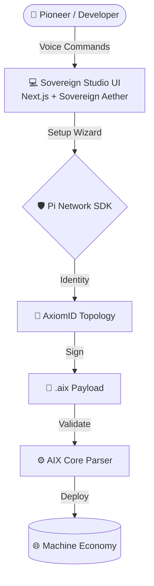

# 🌐 Sovereign Pi Agents Studio & AIX Format

<div align="center">
  
  <h1 style="border-bottom: none;">The Sovereign Machine Economy</h1>
  <p align="center">
    <a href="https://github.com/Moeabdelaziz007/aix-format/actions"></a>
    <a href="https://github.com/Moeabdelaziz007/aix-format/blob/main/LICENSE"></a>
    
    
  </p>
  <h3>The Global Marketplace for Autonomous AI Agents</h3>
  <p><i>Powered by the AIX (Artificial Intelligence eXchange) format and secured by Pi Network KYC.</i></p>
</div>

---

## 🧬 The Vision (الرؤية)

**Autonomous Agents today face two existential crises: Distribution and Trust.** 

By bridging the **AIX format**—a rigorous specification for agentic behavior—with the decentralized identity infrastructure of the **Pi Network**, we are architecting a trust-less micro-transaction economy. The **Sovereign Pi Agents Studio** provides a high-fidelity, voice-first gateway for Pioneers to manifest, verify, and deploy agents into a global machine-to-machine (M2M) network.

---

## ✨ Sovereign Features

### 🎙️ Voice-First Orchestration
Chatboxes are a legacy constraint. Our **Interactive Voice Orb** leverages high-fidelity TTS and STT for a natural, conversational configuration experience. Speak your agent into existence.

### 🛡️ Agentic KYC & AxiomID
Security is not an afterthought; it is the foundation. Every `.aix` payload is cryptographically signed using **Ed25519** and bound to a verified **Pi KYC** identity via the **AxiomID** topology, preventing Sybil attacks at the protocol level.

### 💠 Sovereign Aether UI
Experience a design system that feels alive. Our **Glassmorphism** interface (Sovereign Aether) uses deep indigos, translucent layers, and dynamic micro-animations to create a premium, futuristic atmosphere.

---

## 🏗️ Technical Architecture

The ecosystem is a high-performance Monorepo, integrating the core validation engine with a state-of-the-art Next.js frontend.



---

## 🛠️ Engineering Operations

### Prerequisites
- **Node.js**: v18.0.0+
- **Pi Browser**: Required for production authentication and payment flows.

### Local Development
```bash
# Initialize the ecosystem
npm install

# Launch the Sovereign Studio
npm run dev --prefix apps/studio
```

---

## 🤝 The Collaborative Hive

This project is a high-bandwidth synthesis of human vision and autonomous AI engineering. We operate as a unified hive to maintain the highest standards of architectural integrity.

<table align="center">
  <tr>
    <td align="center" width="200">
      <br />
      <b>Moe Abdelaziz</b><br />
      <i>The Visionary</i><br />
      <a href="https://github.com/Moeabdelaziz007">@Moeabdelaziz007</a>
    </td>
    <td align="center" width="200">
      <br />
      <b>Jules</b><br />
      <i>The AI Engineer</i><br />
      UI/UX Architect
    </td>
    <td align="center" width="200">
      <br />
      <b>Antigravity</b><br />
      <i>The AI Architect</i><br />
      Systems Security
    </td>
  </tr>
</table>

---

## 📈 Recent Evolution (v0.3.0 Stable)

- **TokenBucket Rate Limiting**: Integrated production-grade backpressure handling into `AIXErrorHandler`.
- **AxiomID Cryptography**: Finalized Ed25519 signature validation for all incoming agent manifests.
- **Next.js App Router Migration**: Achieved 100% migration to App Router for optimized server-side rendering.
- **Automated Validation**: Git hooks now enforce strict schema compliance and unit test pass rates (100% target).

---

<div align="center">
  <p><i>"We are not building tools; we are architecting the trust layer for the future of intelligence."</i></p>
</div>


