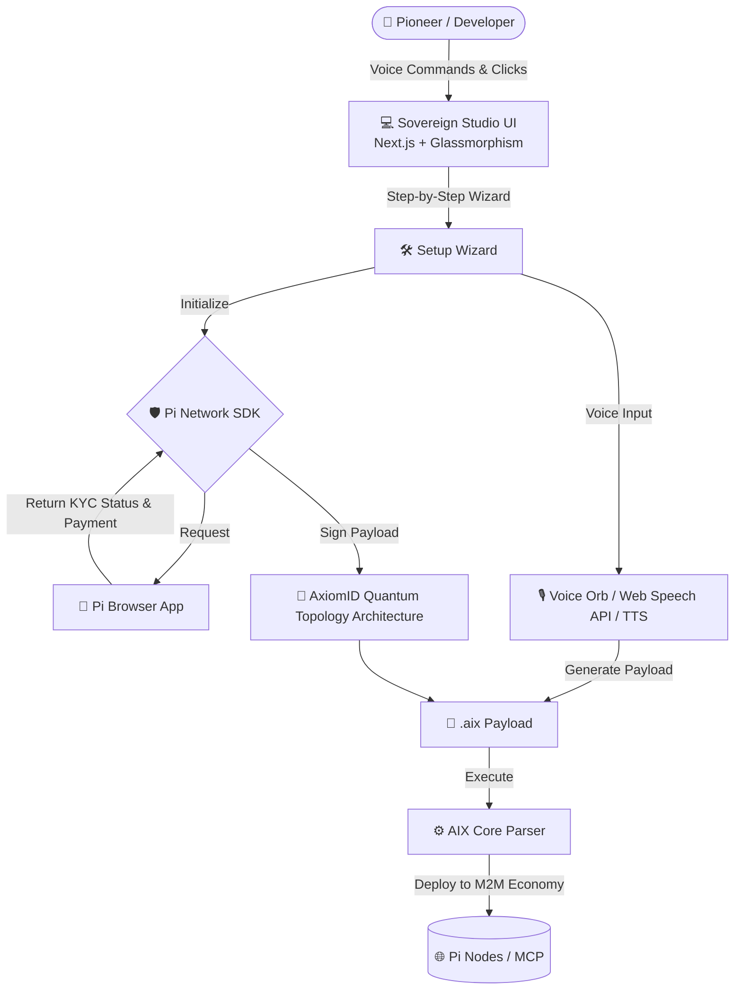

# 🌐 Sovereign Pi Agents Studio & AIX Format

<div align="center">
  
  <h3>The Global Marketplace for Autonomous AI Agents</h3>
  <p>Powered by <b>AIX (Artificial Intelligence eXchange)</b> format and secured by <b>Pi Network KYC</b>.</p>
</div>

---

## 🚀 Vision (الرؤية)

**[EN]** The biggest challenge for Autonomous Agents today is not intelligence, but **Distribution** and **Trust**. By combining the robust DNA of the `.aix` format with the decentralized infrastructure and KYC-verified user base of the Pi Network, we are building a true Machine-to-Machine (M2M) micro-transaction economy. The Sovereign Pi Agents Studio allows users to configure agents via Voice-First UI, sign their `.aix` payloads with their Pi KYC identity (preventing Sybil attacks), and deploy them to the network.

**[AR]** التحدي الأكبر للوكلاء المستقلين (Autonomous Agents) اليوم ليس الذكاء، بل **"التوزيع" (Distribution)** و **"الثقة" (Trust)**. من خلال دمج "الحمض النووي" المتمثل في صيغة `.aix` مع البنية التحتية اللامركزية وقاعدة المستخدمين الموثقين (KYC) لشبكة Pi، فإننا نبني اقتصاداً حقيقياً للآلات (Machine-to-Machine) يعتمد على المعاملات الدقيقة. يتيح "استوديو Pi للوكلاء" للمستخدمين إعداد الوكلاء عبر واجهة صوتية (Voice-First)، وتوقيع ملفاتهم بهوية Pi KYC (لمنع هجمات Sybil)، ونشرهم في الشبكة.

---

## 🏗️ Architecture (الهندسة المعمارية)

The project is structured as a modern Monorepo, bridging the core AIX parser with a high-end Next.js front-end.



### 🌟 Key Features

1. **Step-by-Step Setup Wizard:** A guided, beginner-friendly process to configure and deploy agents without coding knowledge.
2. **Interactive Voice Orb with TTS:** Speak to configure agents, and the AIX engine will provide audible feedback confirmation.
3. **Quantum Topology KYC Security:** High-end visual architecture for Agentic KYC bindings, ensuring a Sovereign Proof of Ownership through Ed25519 signatures and the `@pinetwork-js/sdk`.
4. **Glassmorphism UI ("Sovereign Aether"):** Ethereal design system relying on deep indigos, charcoals, and translucent layers.
5. **Polyglot & Model Agnostic:** The Studio acts as the Gateway. The execution layer (AIX core) is designed to run seamlessly on Go/Rust backend execution engines in the future, supporting any LLM.

---

## 🛠️ Quick Start

This repository uses npm workspaces (`apps/studio` and `core/`).

### Prerequisites
- Node.js >= 18.0.0
- Pi Browser (for full authentication testing)

### Installation
```bash
# Install dependencies for both core and studio
npm install

# Run the Studio development server
npm run dev --prefix apps/studio
```

Open [http://localhost:3000](http://localhost:3000) with your browser to see the result.

---

## 🔒 AIX Agent Runtime Validator (CLI)

The repository includes a strict validation tool designed for CI/CD pipelines and deployment gateways. This ensures no agent enters the network without meeting structural, cryptographic, and security constraints.

### Usage

```bash
node bin/aix-validate.js path/to/your-agent.aix [options]
```

### Flags

- `--strict-kyc`: **(Important)** Enforces that the agent is KYC-verified. Fails the validation if a valid `kyc_proof` is missing, or if the `identity_layer` DID is invalid. Also requires `meta.version` to be a `2.x.x` version.
- `--security`: Verifies the SHA-256 checksum embedded in the `.aix` payload matches the actual file hash.
- `--verbose`: Outputs deep inspection data (capabilities, APIs, MCP servers, warnings).

### GitHub Actions

A GitHub action is included (`.github/workflows/aix-validation.yml`) which automatically validates all modified `.aix` payloads in Pull Requests, running with the `--strict-kyc` and `--security` flags enabled. If an agent fails KYC checks, the PR is blocked.

---

## 🤝 Credits & Maintainers

- **Moe Abdelaziz** (@Moeabdelaziz007) - Visionary, Protocol Architect & Pi Integration Lead.
- **Jules (AI Engineer)** - Engineering Partner & UI/UX Architect.

*We are building the trust layer for the Machine Economy.*
