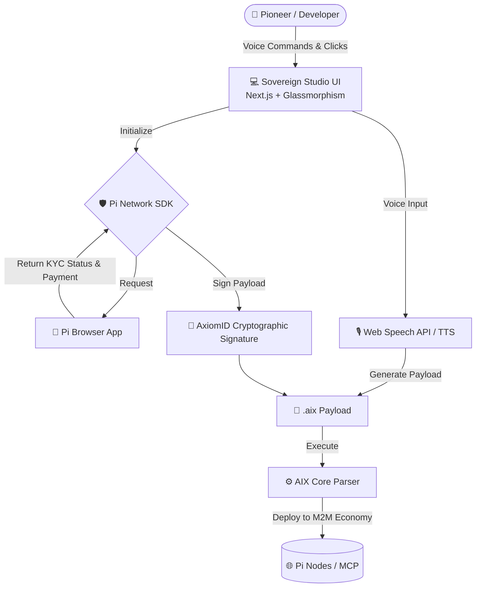

# 🌐 Sovereign Pi Agents Studio

<div align="center">
  
  <h3>The Global Marketplace for Autonomous AI Agents</h3>
  <p>Powered by <b>AIX (Artificial Intelligence eXchange)</b> format and secured by <b>Pi Network KYC</b>.</p>
</div>

---

## 🚀 Vision (الرؤية)

**[EN]** The biggest challenge for Autonomous Agents today is not intelligence, but **Distribution** and **Trust**. By combining the robust DNA of the `.aix` format with the decentralized infrastructure and KYC-verified user base of the Pi Network, we are building a true Machine-to-Machine (M2M) micro-transaction economy. The Sovereign Pi Agents Studio allows users to configure agents via Voice-First UI, sign their `.aix` payloads with their Pi KYC identity (preventing Sybil attacks), and deploy them to the network.

**[AR]** التحدي الأكبر للوكلاء المستقلين (Autonomous Agents) اليوم ليس الذكاء، بل **"التوزيع" (Distribution)** و **"الثقة" (Trust)**. من خلال دمج "الحمض النووي" المتمثل في صيغة `.aix` مع البنية التحتية اللامركزية وقاعدة المستخدمين الموثقين (KYC) لشبكة Pi، فإننا نبني اقتصاداً حقيقياً للآلات (Machine-to-Machine) يعتمد على المعاملات الدقيقة. يتيح "استوديو Pi للوكلاء" للمستخدمين إعداد الوكلاء عبر واجهة صوتية (Voice-First)، وتوقيع ملفاتهم بهوية Pi KYC (لمنع هجمات Sybil)، ونشرهم في الشبكة.

---

## 🏗️ Architecture (الهندسة المعمارية)

The project is structured as a modern Monorepo, bridging the core AIX parser with a high-end Next.js front-end.



### 🌟 Key Features

1. **Voice-First Orchestration:** Replaced traditional chatboxes with an interactive Voice Orb. Speak to configure and deploy your agents on the fly.
2. **KYC-First Deployment:** Every `.aix` payload uploaded to the Studio requires a Cryptographic KYC Signature via Pi Network. This ensures a Sovereign Proof of Ownership.
3. **Glassmorphism UI ("Sovereign Aether"):** A high-end, ethereal design system relying on deep indigos, charcoals, and translucent layers instead of cyberpunk tropes.
4. **Polyglot & Model Agnostic:** The Studio acts as the Gateway. The execution layer (AIX core) is designed to run seamlessly on Go/Rust backend execution engines in the future, supporting any LLM (Open Source or Closed).

---

## 🛠️ Quick Start

This repository uses npm workspaces (`apps/studio` and `core/`).

### Prerequisites
- Node.js >= 18.0.0
- Pi Browser (for full authentication testing)

### Run Studio Development Server
```bash
npm run dev --prefix apps/studio
```

Open [http://localhost:3000](http://localhost:3000) with your browser to see the result.

---

## 🌍 Vercel Deployment & Domain Claiming (Pi Network)

To verify your domain with Pi Network (`axiomid.app` or your custom domain), follow these steps:

1. **Push your code to GitHub.**
2. Go to **Vercel** and click **"Add New Project"**.
3. Import this repository.
4. In the Vercel project configuration:
   - **Framework Preset:** Next.js
   - **Root Directory:** `apps/studio` ⚠️ *(Crucial Step)*
5. Click **Deploy**.
6. Once deployed, Vercel will give you a domain (e.g., `your-app.vercel.app`) or you can link your custom domain (`axiomid.app`).
7. The required Pi Network Validation Key is already included in `apps/studio/public/validation-key.txt`.
8. Go to the **Pi Developer Portal** in the Pi Browser.
9. Enter your Vercel URL in the "App Domain" field.
10. Click **Verify Domain**. It will successfully find the `validation-key.txt` file and verify your ownership!

---

## 🤝 Credits & Maintainers

- **Moe Abdelaziz** (@Moeabdelaziz007) - Visionary, Protocol Architect & Pi Integration Lead.
- **Jules (AI Engineer)** - Engineering Partner & UI/UX Architect.

*We are building the trust layer for the Machine Economy.*
