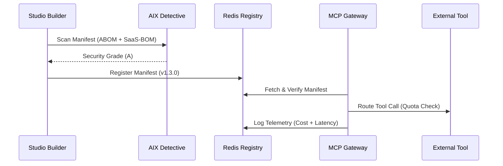

# 🏛️ AIX v1.3 Sovereign Architecture: The Unified Map

🇬🇧 This document defines the structural integration between the AIX Schema, Studio, and MCP Gateway.
🇦🇪 يحدد هذا المستند التكامل الهيكلي بين سكيمة AIX، Studio، وبوابة MCP.

---

## 1. The Core DNA: AIX Schema v1.3.0
The [JSON Schema](file:///Users/cryptojoker710/Desktop/aix-format/schemas/aix.schema.json) is the ultimate source of truth.
- **Structural Rules**: Enforced by Ajv in the Studio and CLI.
- **Version Lock**: Frozen at `1.3.0`. Any breaking change requires a major protocol bump.

## 2. The Verification Layer: AIX Detective
Located in `packages/core`, the Detective runs **Security Invariants** that go beyond basic schema validation:
- **Rule**: `infra` agents MUST have `build_provenance`.
- **Rule**: `mcp` usage MUST have `sandboxed: true`.
- **Output**: Generates a **Security Grade (A-F)** used by the Marketplace.

## 3. The Creation Hub: AIX Studio
The [Next.js Studio](file:///Users/cryptojoker710/Desktop/aix-format/apps/studio) provides the user-facing lifecycle:
- **Builder**: Real-time validation against the Schema + Detective.
- **Registry**: Redis-backed storage for all verified agent manifests.
- **Analytics**: Pulls telemetry from the MCP Gateway to show usage and spend.

## 4. The Gateway: MCP Secure Routing
The [MCP Gateway](file:///Users/cryptojoker710/Desktop/aix-format/packages/mcp-gateway) is the runtime execution point:
- **Authentication**: Validates AxiomDIDs.
- **Telemetry**: Records every tool call into Redis (`aix:metrics:*`).
- **Quotas**: Enforces rate limits based on the agent's KYC tier.

---

## 🔄 Data Flow: The Sovereign Lifecycle

## 🛠️ Infrastructure Baseline
- **Storage**: Upstash Redis (Unified Adapter).
- **Identity**: `did:axiom` (AxiomID Authority).
- **Release**: `v1.3.0-schema-freeze`.
