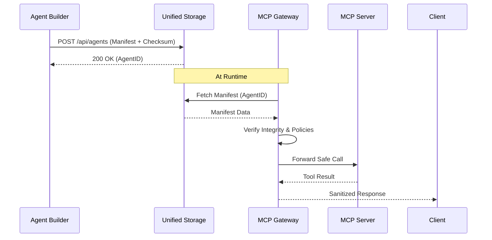

# AIX System Flows

## 1. Agent Builder → Storage → MCP Gateway

This flow describes how an agent manifest is created, secured, and eventually consumed by the MCP Gateway.

### A. Builder Phase
1. **Design**: The user uses the AIX Studio Builder to define agent properties (Persona, Skills, Requirements, etc.).
2. **Validation**: `LiveValidator` ensures the manifest matches the AIX Enhanced Schema in real-time.
3. **Security**: The builder computes a **SHA-256 checksum** of the manifest for integrity.
4. **Identity**: The agent is assigned an **AxiomDID** (e.g., `did:aix:123...`).

### B. Storage Phase
1. **Deployment**: When the user clicks "Deploy", the Studio sends a `POST` request to `/api/agents`.
2. **Persistence**: The manifest is stored in the **AIX Unified Storage** (Redis-backed).
3. **Registry**: The agent is registered in the Global Agent Registry (GAR) with its manifest URL and checksum.

### C. Gateway Phase
1. **Discovery**: A client (or another agent) discovers the agent via the registry.
2. **Consumption**: The **MCP Gateway** intercepts calls to the agent.
3. **Verification**: 
   - It fetches the manifest from Storage.
   - It verifies the manifest's integrity using the registered checksum.
   - It applies security policies (Allowlist, Tool Authorization, Rate Limiting).
4. **Execution**: Safe tool calls are forwarded to the underlying MCP server.

