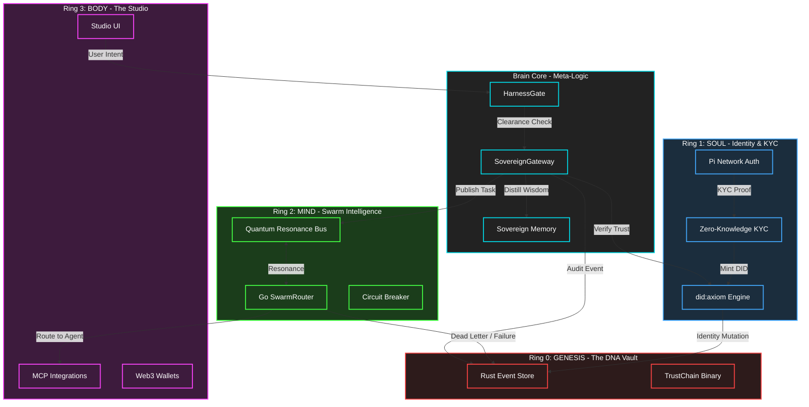

# AIX Quantum Topology Map
## The 4-Ring Sovereign Ecosystem

This document provides a visual representation of the AIX Sovereign Architecture, mapping the interactions between the 4 primary Rings: Genesis, Soul, Mind, and Body.

### Topological Folding
When the `SovereignGateway` receives a task, it collapses this topology, ensuring that clearance (Harness), identity (DID), execution (Swarm), and audit (Rust) are invoked in a singular quantum context window.

// Made with Moe Abdelaziz
