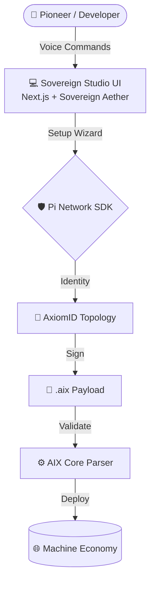

# 🌐 Sovereign Pi Agents Studio & AIX Format

<div align="center">
  
  <h1 style="border-bottom: none;">The Sovereign Machine Economy</h1>
  <h2 style="border-top: none;">اقتصاد الآلات السيادي</h2>
  <p align="center">
    <a href="https://github.com/Moeabdelaziz007/aix-format/actions"></a>
    <a href="https://github.com/Moeabdelaziz007/aix-format/blob/main/LICENSE"></a>
    
    
  </p>
  <h3>The Global Marketplace for Autonomous AI Agents</h3>
  <h3>السوق العالمي لوكلاء الذكاء الاصطناعي المستقلين</h3>
  <p><i>Powered by the AIX (Artificial Intelligence eXchange) format and secured by Pi Network KYC.</i></p>
  <p><i>مدعوم بصيغة AIX ومؤمن بواسطة Pi Network KYC.</i></p>
</div>

---

## 🧬 The Vision | الرؤية

<table width="100%">
<tr>
<td width="50%" valign="top">
**[EN]**
Autonomous Agents today face two existential crises: **Distribution** and **Trust**. By bridging the **AIX format** with the decentralized infrastructure of the **Pi Network**, we are architecting a trust-less micro-transaction economy. The **Sovereign Pi Agents Studio** provides a high-fidelity, voice-first gateway for Pioneers to manifest, verify, and deploy agents into a global machine-to-machine (M2M) network.
</td>
<td width="50%" valign="top" dir="rtl">
**[AR]**
التحدي الأكبر للوكلاء المستقلين اليوم ليس الذكاء، بل **التوزيع** و **الثقة**. من خلال ربط صيغة **AIX** مع البنية التحتية اللامركزية لشبكة **Pi**، نحن نبني اقتصاداً حقيقياً للمعاملات الدقيقة بين الآلات. يوفر استوديو الوكلاء بوابة صوتية متطورة تتيح للمستخدمين إعداد الوكلاء وتوقيعهم بهوية Pi KYC ونشرهم في الشبكة العالمية.
</td>
</tr>
</table>

---

## ✨ Sovereign Features | المميزات السيادية

### 🎙️ Voice-First Orchestration | التوجيه الصوتي أولاً
**[EN]** Chatboxes are a legacy constraint. Our **Interactive Voice Orb** leverages high-fidelity TTS and STT for a natural, conversational configuration experience. Speak your agent into existence.
**[AR]** صناديق الدردشة هي قيد من الماضي. تعتمد "الكرة الصوتية التفاعلية" لدينا على تقنيات تحويل النص إلى صوت والكلام إلى نص لتوفير تجربة محادثة طبيعية. تحدث فقط لإعداد وكيلك فوراً.

### 🛡️ Agentic KYC & AxiomID | التوثيق السيادي
**[EN]** Security is not an afterthought. Every `.aix` payload is signed using **Ed25519** and bound to a verified **Pi KYC** identity via the **AxiomID** topology, preventing Sybil attacks.
**[AR]** الأمن ليس مجرد فكرة ثانوية. يتم توقيع كل ملف `.aix` باستخدام **Ed25519** وربطه بهوية **Pi KYC** موثقة عبر بنية **AxiomID**، مما يمنع هجمات التزييف.

### 💠 Sovereign Aether UI | واجهة الأثير السيادي
**[EN]** Experience a design system that feels alive. Our **Glassmorphism** interface uses deep indigos, translucent layers, and dynamic micro-animations to create a premium atmosphere.
**[AR]** اختبر نظام تصميم يشع بالحياة. تعتمد واجهة **Glassmorphism** الخاصة بنا على الألوان العميقة والطبقات الشفافة والرسوم المتحركة الدقيقة لخلق بيئة مستقبلية راقية.

---

## 🏗️ Technical Architecture | الهندسة المعمارية

<table width="100%">
<tr>
<td width="50%" valign="top">
**[EN]** The ecosystem is a high-performance Monorepo, integrating the core validation engine with a state-of-the-art Next.js frontend.
</td>
<td width="50%" valign="top" dir="rtl">
**[AR]** تم بناء المشروع على هيكل Monorepo حديث، يربط بين المحلل الأساسي لـ AIX وواجهة أمامية متطورة مبنية بـ Next.js.
</td>
</tr>
</table>



---

## 🛠️ Engineering Operations | العمليات الهندسية

### Prerequisites | المتطلبات الأساسية
- **Node.js**: v18.0.0+
- **Pi Browser**: Required for production authentication | مطلوب لمصادقة شبكة Pi
- **Git**: For version control and deployment | لإدارة الإصدارات والنشر

### Local Development | التطوير المحلي
```bash
# Initialize the ecosystem | تثبيت الاعتمادات
npm install

# Launch the Sovereign Studio | تشغيل الاستوديو
npm run dev --prefix apps/studio
```

---

## 📈 Recent Evolution | التطورات الأخيرة (v0.3.0 Stable)

<table width="100%">
<tr>
<td width="50%" valign="top">
**[EN]**
- **TokenBucket Rate Limiting**: Integrated production-grade backpressure handling.
- **AxiomID Cryptography**: Finalized Ed25519 signature validation.
- **Next.js App Router Migration**: 100% migration for SSR.
- **Automated Validation**: Git hooks enforce strict schema compliance.
</td>
<td width="50%" valign="top" dir="rtl">
**[AR]**
- **تحديد معدل TokenBucket**: دمج معالجة الضغط الخلفي بمستوى الإنتاج.
- **تشفير AxiomID**: الانتهاء من التحقق من توقيع Ed25519.
- **الهجرة إلى Next.js App Router**: هجرة بنسبة 100% لتحسين عرض الصفحات.
- **التحقق الآلي**: تفرض خطافات Git امتثالاً صارماً للمخطط.
</td>
</tr>
</table>

---

## 🤝 The Collaborative Hive | الخلية التعاونية

<div align="center">
  <table style="border: none;">
    <tr>
      <td align="center" width="250">
        <br />
        <br />
        <b>Mohamed Abdelaziz</b><br />
        <i>The Visionary Architect</i><br />
        <a href="https://github.com/Moeabdelaziz007">@Moeabdelaziz007</a>
      </td>
      <td align="center" width="250">
        <br />
        <br />
        <b>Jules</b><br />
        <i>The UI/UX Agent</i><br />
        <i>Interface Architect</i>
      </td>
      <td align="center" width="250">
        <br />
        <br />
        <b>Antigravity</b><br />
        <i>The Systems AI</i><br />
        <i>Security Architect</i>
      </td>
    </tr>
  </table>
</div>

---

<div align="center">
  <p><i>"We are not building tools; we are architecting the trust layer for the future of intelligence."</i></p>
  <p><i>"نحن لا نبني أدوات؛ نحن نصمم طبقة الثقة لمستقبل الذكاء."</i></p>
</div>


